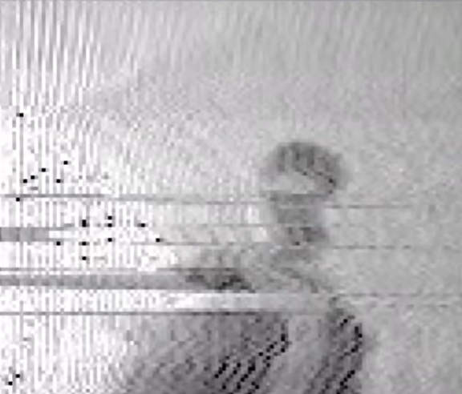

# LiveSSTV - Transmit live streams via SSTV

This work is heavily based on https://github.com/dnet/pySSTV, id recommand checking it out.


> Live sstv capture via my webcam

# Installation
```bash
git clone https://github.com/douxxtech/livesstv
cd livesstv
pip install opencv-python pillow numpy
```

# Usage
For the webcam livestream: `python3 main.py cam`  
For the screen livestream: `python3 main.py screen`


